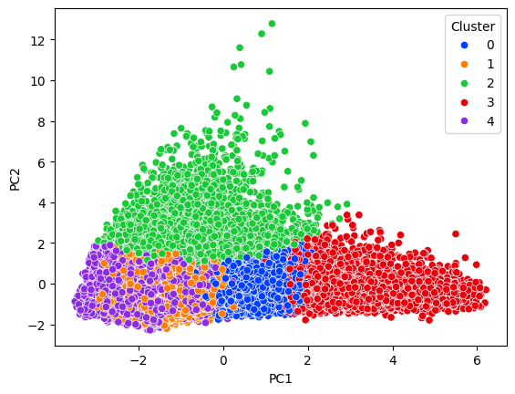

# Customer Segmentation with K-Means Clustering

This repository contains a project demonstrating how to segment a customer base using unsupervised machine learning. The notebook walks through the entire process, from data cleaning and feature scaling to clustering with K-Means and deriving actionable business insights from the results.

*__Note on Confidentiality:__ This project was completed as part of my MSc at the University of Cambridge. To comply with academic policy, the raw dataset has been excluded to protect confidentiality. This notebook serves to demonstrate the complete methodology and results on the anonymized data. **The anonymized dataset can be shared upon request.** *

---

## Business Problem

This project aims to move beyond a "one-size-fits-all" marketing approach by segmenting a customer base into distinct groups based on their purchasing behavior. By identifying key customer personas, a business can enable targeted marketing campaigns, personalized promotions, and proactive retention strategies to maximize profitability and customer loyalty.

---

## Skills & Technologies Demonstrated

* **Unsupervised Learning:** K-Means Clustering, Elbow Method for Optimal K
* **Dimensionality Reduction:** Principal Component Analysis (PCA) for visualization
* **Data Preprocessing:** Feature Scaling (StandardScaler), Data Cleaning
* **Python Libraries:** Pandas, Scikit-learn, Matplotlib, Seaborn

---

## Key Findings

The clustering analysis successfully revealed five distinct customer segments, each requiring a unique strategic approach:

* **Core Customer Segments:** High-frequency, high-revenue customers and low-frequency, high-value customers were identified as ideal targets for tailored campaigns.
* **Potential Churn Segment:** A group of older customers with declining activity was flagged for a proactive re-engagement initiative.
* **Age-Differentiated Segment:** Two intertwined clusters were found to be primarily differentiated by age, suggesting they should either be merged or targeted with age-specific campaigns.

The notebook concludes with a detailed breakdown of these strategic recommendations.

---

---

## How to Use

The included Jupyter Notebook (`.ipynb`) contains the complete analysis. While the original dataset is not provided publicly, all outputs, visualizations, and conclusions are visible, demonstrating the full workflow and final insights.
